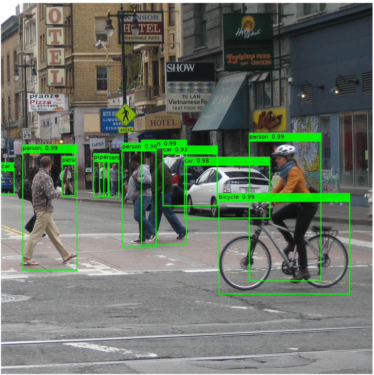
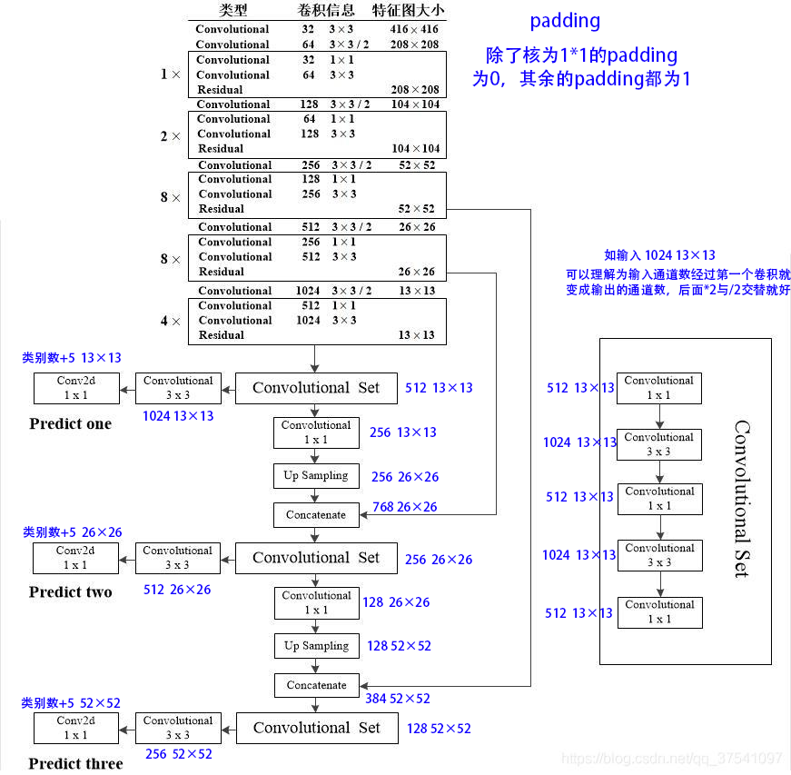

# pytorch yolo复现

想着入门pytorch，用pytorch复现一下yolo算法，其实yolo的原理一天左右就完全搞懂了，但是真正写起代码来，就是会有各种细节不太清除，我是先从吴恩达的视频开始，然后参考着两位大佬的复现代码[eriklindernoren的代码](https://github.com/eriklindernoren/PyTorch-YOLOv3)、[bubbliiiing的代码](https://github.com/bubbliiiing/yolo3-pytorch)，可能是我对pytorch还不太熟悉，陆陆续续搞了一个星期才写完了自己的yolo复现，并在`coco2014`与`voc2007`的数据集进行了训练

```python
+---------------+--------+--------+--------+
| class         | AP     | R      | P      |
+---------------+--------+--------+--------+
| person        | 0.6289 | 0.6502 | 0.8299 |
| bicycle       | 0.4096 | 0.4228 | 0.8567 |
| car           | 0.4843 | 0.5158 | 0.7979 |
| motorbike     | 0.5602 | 0.5727 | 0.9049 |
| aeroplane     | 0.7055 | 0.7087 | 0.9697 |
| bus           | 0.7271 | 0.7331 | 0.9340 |
| train         | 0.8222 | 0.8252 | 0.9594 |
| truck         | 0.3978 | 0.4182 | 0.8164 |
| boat          | 0.3047 | 0.3243 | 0.8213 |
| trafficlight  | 0.4162 | 0.4519 | 0.7878 |
| firehydrant   | 0.7988 | 0.8015 | 0.9720 |
| stopsign      | 0.6801 | 0.6851 | 0.9073 |
| parkingmeter  | 0.4942 | 0.5098 | 0.8529 |
| bench         | 0.3180 | 0.3323 | 0.8272 |
| bird          | 0.4487 | 0.4760 | 0.7925 |
| cat           | 0.8485 | 0.8574 | 0.9347 |
| dog           | 0.7597 | 0.7741 | 0.8810 |
| horse         | 0.7333 | 0.7393 | 0.9143 |
| sheep         | 0.5716 | 0.6132 | 0.7643 |
| cow           | 0.5034 | 0.5231 | 0.8685 |
| elephant      | 0.7189 | 0.7246 | 0.9534 |
| bear          | 0.8966 | 0.9004 | 0.9369 |
| zebra         | 0.7496 | 0.7534 | 0.9537 |
| giraffe       | 0.7887 | 0.7912 | 0.9735 |
| backpack      | 0.2107 | 0.2352 | 0.7640 |
| umbrella      | 0.4713 | 0.4921 | 0.8343 |
| handbag       | 0.1493 | 0.1706 | 0.7516 |
| tie           | 0.5108 | 0.5313 | 0.8255 |
| suitcase      | 0.4338 | 0.4492 | 0.8811 |
| frisbee       | 0.8040 | 0.8086 | 0.9380 |
| skis          | 0.2839 | 0.3079 | 0.8311 |
| snowboard     | 0.4891 | 0.5164 | 0.8742 |
| sportsball    | 0.5358 | 0.5582 | 0.8161 |
| kite          | 0.3883 | 0.4260 | 0.7788 |
| baseballbat   | 0.5519 | 0.5705 | 0.8969 |
| baseballglove | 0.5524 | 0.5630 | 0.8807 |
| skateboard    | 0.6872 | 0.6965 | 0.9247 |
| surfboard     | 0.5677 | 0.5810 | 0.8927 |
| tennisracket  | 0.7075 | 0.7134 | 0.9539 |
| bottle        | 0.3835 | 0.4163 | 0.7795 |
| wineglass     | 0.4638 | 0.4822 | 0.8452 |
| cup           | 0.4557 | 0.4780 | 0.8194 |
| fork          | 0.3253 | 0.3446 | 0.8127 |
| knife         | 0.2310 | 0.2621 | 0.7278 |
| spoon         | 0.1965 | 0.2206 | 0.7402 |
| bowl          | 0.4338 | 0.4689 | 0.7844 |
| banana        | 0.2772 | 0.2950 | 0.8096 |
| apple         | 0.2573 | 0.3176 | 0.6220 |
| sandwich      | 0.4757 | 0.5058 | 0.8436 |
| orange        | 0.2994 | 0.3518 | 0.6737 |
| broccoli      | 0.2527 | 0.2814 | 0.7939 |
| carrot        | 0.2074 | 0.2399 | 0.7585 |
| hotdog        | 0.4637 | 0.5010 | 0.8407 |
| pizza         | 0.5795 | 0.6067 | 0.9006 |
| donut         | 0.5242 | 0.5701 | 0.7702 |
| cake          | 0.5441 | 0.5637 | 0.8535 |
| chair         | 0.3562 | 0.3804 | 0.8133 |
| sofa          | 0.5047 | 0.5366 | 0.7821 |
| pottedplant   | 0.3533 | 0.3737 | 0.8468 |
| bed           | 0.6665 | 0.6828 | 0.8699 |
| diningtable   | 0.3767 | 0.4216 | 0.7326 |
| toilet        | 0.8128 | 0.8223 | 0.9495 |
| tvmonitor     | 0.7254 | 0.7375 | 0.9046 |
| laptop        | 0.6993 | 0.7116 | 0.9033 |
| mouse         | 0.6550 | 0.6651 | 0.8871 |
| remote        | 0.3896 | 0.4120 | 0.8294 |
| keyboard      | 0.5573 | 0.5623 | 0.9444 |
| cellphone     | 0.4309 | 0.4468 | 0.8360 |
| microwave     | 0.7174 | 0.7310 | 0.8874 |
| oven          | 0.4837 | 0.5055 | 0.8761 |
| toaster       | 0.1239 | 0.1282 | 0.8333 |
| sink          | 0.4782 | 0.5131 | 0.8443 |
| refrigerator  | 0.6729 | 0.6802 | 0.9165 |
| book          | 0.1305 | 0.1876 | 0.4934 |
| clock         | 0.6956 | 0.7022 | 0.9333 |
| teddybear     | 0.4943 | 0.5045 | 0.9273 |
| hairdrier     | 0.0270 | 0.0270 | 1.0000 |
| MAP           | 0.5001 |        |        |
+---------------+--------+--------+--------+
```

# 使用方式

**1.数据集预处理**

先从网上下载coco数据集，在data文件夹里如下图所示进行放置。

```
─coco
  ├─images
  │  ├─train2014
  │  └─val2014
  ├─labels
  │  ├─train2014(空)
  │  └─val2014（空）
  └─instances_train2014.json
  └─instances_val2014.json
```

```
python utils/handleData.py
```

生成对应的txt标签

**训练/预测/验证**

```
python train.py/predict.py/valid.py
```



预训练权重使用[bubbliiiing大佬的](https://github.com/bubbliiiing/yolo3-pytorch)

# 搭建YOLOv3模型

其实yolov3的模型十分简单，看起来很吓唬人，其实就一个主干网络`darknet53`加卷积块`convolutional set`与简单卷积核和上采样时的特征合并，下面这张图很全面低反映了整个网络的细节，因为网上的很多图片并没有把具体的细节，如通道数与padding展示出来，而且在非主干网络上也没有标明输出，因此我在图上用蓝色字添加上了`通道数  输出大小`的信息，**padding**的话除了核为1*1的padding为0，其余的padding都为1，也就是说，只有步长为2的时候，才不是“same”的padding



从图上可以看出，其实整个几个部分：**darknet53**、**convolutional set**、**最后的输出层**，**上采样层**，但是他们中很多部分都由**普通的卷积层（带激活与正则化）**组成。

**1.普通的卷积层（带激活与正则化）**

```python
#==================================#
#          简单的卷积层                      
#==================================#
class Conv(nn.Module):
    def __init__(self, inputC, outputC, keralSize, stride = 1, padding = "same") -> None:
        super(Conv, self).__init__()
        self.m = nn.Sequential(
            nn.Conv2d(inputC, outputC, keralSize, stride, padding, bias=False),
            nn.BatchNorm2d(outputC),
            nn.LeakyReLU(0.1)
        )
    def forward(self, x):
        return self.m(x)
```

卷积--->正则化---->激活

**2.残差块**

其实残差块也是由普通卷积层构成，只是有跳连接的部分。

```python
#==================================#
#             残差块                      
#==================================#
class Residual(nn.Module):
    def __init__(self, inputC) -> None:
        super(Residual, self).__init__()
        tempC = inputC // 2
        self.m = nn.Sequential(
            Conv(inputC, tempC, 1, 1, 0),
            Conv(tempC, inputC, 3, 1, 1)
        )
    def forward(self, x):
        return x + self.m(x)
```

**3.convolutional set**

按照上图中的结构，可以很容易写出convolutional set，也是由普通残差块组成而已

```python
#==================================#
#           convSet                    
#==================================#
class convSet(nn.Module):
    def __init__(self, inputC, outputC, midC) -> None:
        super(convSet, self).__init__()
        self.m = nn.Sequential(
            Conv(inputC, outputC, 1),
            Conv(outputC, midC, 3),
            Conv(midC, outputC, 1),
            Conv(outputC, midC, 3),
            Conv(midC, outputC, 1),
        )
    def forward(self, x):
        return self.m(x)
```

**4.输出层**

输出层有三个，分别输出13*13、26\*26、52\*52的图像，这里我添加了创建对应格子的网络grid的过程，后面会用到，对于模型来说没有影响

```python
#==================================#
#           lastLayer                   
#==================================#
class LastLayer(nn.Module):
    def __init__(self, inputC, outputC, anchor=None) -> None:
        super(LastLayer, self).__init__()
        self.grid = None
        self.anchor = np.array(anchor)
        self.anchorScaled = []
        self.stride = 1
        self.shape = None
        self.m = nn.Sequential(
            Conv(inputC, inputC * 2, 3),
            nn.Conv2d(inputC * 2, outputC, 1)
        )
    def forward(self, x):
        o = self.m(x)
        if self.grid is None:
            self._createGrid(o.shape)
        return o
    def _createGrid(self, shape):
        b,c,h,w = shape
        self.shape = (h, w)
        self.stride = CONST.inputShape[0] / h
        self.anchorScaled = torch.tensor(self.anchor / self.stride, device=CONST.device)
        grid = torch.ones((b,len(self.anchor),h,w,4),device=CONST.device)
        gridY, gridX = torch.meshgrid(torch.arange(h), torch.arange(w), indexing="ij")
        grid[...,0] *= gridX.to(CONST.device).unsqueeze(0)
        grid[...,1] *= gridY.to(CONST.device).unsqueeze(0)
        grid[...,2] *= self.anchorScaled[:,0].view(1,len(self.anchor),1,1)
        grid[...,3] *= self.anchorScaled[:,1].view(1,len(self.anchor),1,1)
        self.grid = grid
```

**5.主干的darknet53**

```python
#==================================#
#           darknet53                       
#==================================#
class Darknet53(nn.Module):
    def __init__(self) -> None:
        super(Darknet53, self).__init__()
        # 定义darknet53的层数
        self.layoutNumber = [1, 2, 8, 8, 4]
        self.layerA = nn.Sequential(
            Conv(3, 32, 3, 1, 1),
            self.MultiResidual(32, 64, 1),
            self.MultiResidual(64, 128, 2),
            self.MultiResidual(128, 256, 8)
        )
        self.layerB = self.MultiResidual(256, 512, 8)
        self.layerC = self.MultiResidual(512, 1024, 4)

        # 进行权值初始化
        for m in self.modules():
            if isinstance(m, nn.Conv2d):
                n = m.kernel_size[0] * m.kernel_size[1] * m.out_channels
                m.weight.data.normal_(0, math.sqrt(2. / n))
            elif isinstance(m, nn.BatchNorm2d):
                m.weight.data.fill_(1)
                m.bias.data.zero_()
    
    def forward(self, x):
        out1 = self.layerA(x)
        out2 = self.layerB(out1)
        out3 = self.layerC(out2)
        return out1, out2, out3

    # 多层的残差网络
    def MultiResidual(self, inputC, outputC, count):
        t = [Conv(inputC, outputC, 3, 2, 1) if i == 0 else Residual(outputC) for i in range(count + 1)]
        return nn.Sequential(*t)
```

**6.最终的yolo模型**

将上面的几个部分和在一起，就是最终的yolo模型了

```python
#==================================#
#           定义yolo模型                        
#==================================#
class MyYOLO(nn.Module):
    def __init__(self) -> None:
        super(MyYOLO, self).__init__()
        # 得到 1024*13*13
        self.darknet53 = Darknet53()
        # 得到 512*13*13
        self.convSet1 = convSet(1024, 512, 1024)
        # 得到 256*26*26, 但是后面要和另一层的输出合起来，得到的应该是 (512+256)*26*26
        self.layerA = nn.Sequential(
            Conv(512, 256, 1),
            nn.Upsample(scale_factor=2, mode='nearest')
        )
        # 得到 256*26*26
        self.convSet2 = convSet(256 + 512, 256, 512)
        
        # 得到 128*52*52, 但是后面要和另一层的输出合起来，得到的应该是 (128+256)*52*52
        self.layerB = nn.Sequential(
            Conv(256, 128, 1),
            nn.Upsample(scale_factor=2, mode='nearest')
        )
        # 得到 256*26*26
        self.convSet3 = convSet(128 + 256, 128, 256)

        # 得到 75*13*13
        self.predict1 = LastLayer(512, CONST.anchorNumber * (5 + CONST.classNumber), anchor=CONST.anchor[0])
        # 得到 75*26*26
        self.predict2 = LastLayer(256, CONST.anchorNumber * (5 + CONST.classNumber), anchor=CONST.anchor[1])
        # 得到 75*52*52
        self.predict3= LastLayer(128, CONST.anchorNumber * (5 + CONST.classNumber), anchor=CONST.anchor[2])
        self.lastLayers = [self.predict1, self.predict2, self.predict3]
    def forward(self, x):
        x1, x2, x3 = self.darknet53(x)
        convOut1 = self.convSet1(x3)
        out1 = self.predict1(convOut1)
        layerOut = self.layerA(convOut1)
        additon = torch.cat([layerOut, x2], 1)
        convOut2 = self.convSet2(additon)
        out2 = self.predict2(convOut2)
        layerOut = self.layerB(convOut2)
        additon = torch.cat([layerOut, x1], 1)
        convOut3 = self.convSet3(additon)
        out3 = self.predict3(convOut3)
        return out1, out2, out3
```

**到目前为止，整个yolo模型构建完成**

模型输出的是一个长度为3的list。每个list的大小分别是

* [batch_size，先验框数量，13，13，5+类别数]
* [batch_size，先验框数量，26，26，5+类别数]
* [batch_size，先验框数量，52，52，5+类别数]

## 训练

### 1.获取数据集

使用pytorch自带的`dataset`与`dataloader`进行数据集的加载，先从网上下载coco数据集，在data文件夹里如下图所示进行放置。

```
─coco
  ├─images
  │  ├─train2014
  │  └─val2014
  └─instances_train2014.json
  └─instances_val2014.json
```

然后使用`handleData.py`来进行数据集的预处理，生成标签与对应的目标框，并将目标框变为[x,y,w,h]，中心点与宽高模式。在label文件夹下生成对应的label。

```
16 0.6066874999999999 0.3413807531380753 0.54415625 0.51
```

### 2.数据增强

利用`imgaug`模块进行数据的预处理与增强，包括将图片保持宽高比地缩放为（416，416）大小，位移，镜像等操作

```python
# 应用iaa的图像数据增强类
class imgAug():
    def __init__(self) -> None:
        self.argument = None
    def __call__(self, data):
        img, boxes = data
        bbs = []
        for item in boxes:
            bbs.append(BoundingBox(*item[1:], label=item[0]))
        bbs = BoundingBoxesOnImage(bbs, shape=img.shape)
        img, bbs = self.argument(image = img, bounding_boxes=bbs)
        bbs = bbs.clip_out_of_image()
        for i, item in enumerate(bbs):
            boxes[i,:] = np.array([item.label, item.x1, item.y1, item.x2, item.y2])
        return img, boxes
# 训练集数据增强
TRAIN_TRANSFORMS = transforms.Compose([
    AbsoluteLabel(),
    xywh2xyxy(),
    ImgUp(),
    CenterPlcae(),
    ReSize(),
    RelativeLabel(),
    xyxy2xywh(),
    ToTensor()
])
```


### 3.损失函数

损失函数实际上就是：期望yolo模型的输出与实际yolo模型输出的损失，分别计算输出的x/y/w/h/置信度/分类的交叉熵损失，合并，再反向传播即可。

* 处理目标框，通过交并比得到究竟是哪个先验框负责预测这个目标框，将先验框的索引记录下来，将所有目标框处理成格式如下的二维数组
  * `[对应batch中第几张图，类别，x，y，w，h，先验框索引]`
  * 并附上对应的格子索引`i`与`j`
* 通过目标框处理后的数据可以得到期望yolo模型的输出
* 预测值与期望值做交叉熵损失

```python
#==================================#
#           损失函数       
#==================================#
def getLoss(yoloOut, yolo,bboxes):
    BCELoss = nn.BCELoss()
    MSELoss = nn.MSELoss()
    bboxes = torch.cat([bboxes, torch.zeros(bboxes.shape[0],1,device=CONST.device)], 1)
    anchorRelate = torch.tensor(CONST.anchor, device=CONST.device).view(-1,2) / 416
    anchorRelate = torch.cat([torch.zeros_like(anchorRelate), anchorRelate], 1)
    boxesWH = torch.cat([torch.zeros_like(bboxes[:,4:6]), bboxes[:,4:6]], 1)
    for i,item in enumerate(boxesWH):
        bboxes[i][6] = torch.argmax(iou(item, anchorRelate)) # [bs, cls, x,y,w,h,an]
    # print(bboxes)
    loss = 0
    for l,output in enumerate(yoloOut):
        lastLayer = yolo.lastLayers[l]
        ba,c,h,w = output.shape
        output = output.view(ba,len(lastLayer.anchor),-1,h,w).permute(0,1,3,4,2).contiguous()
        b, cls, boxesScaled, an, i, j = buildTarget(bboxes, lastLayer, l)
        tConf = torch.zeros_like(output[..., 4], device=CONST.device)
        xLoss,yLoss,wLoss,hLoss,clsLoss = [0,0,0,0,0]
        if b.shape[0] != 0:
            pr = output[b, an, i, j] # type:torch.Tensor
            tConf[b, an, i, j] = 1
            pr[:,:2] = pr[:,:2].sigmoid()
            xLoss = BCELoss(pr[..., 0], boxesScaled[...,0])
            yLoss = BCELoss(pr[..., 1], boxesScaled[...,1])
            wLoss = MSELoss(pr[..., 2], boxesScaled[...,2]) * 0.5
            hLoss = MSELoss(pr[..., 3], boxesScaled[...,3]) * 0.5
            clsLoss = BCELoss(pr[:,5:].sigmoid(), cls)
        confLoss = BCELoss(output[..., 4].sigmoid(),tConf)
        loss = loss + xLoss + yLoss + wLoss + hLoss + clsLoss + confLoss
    return loss
```

### 4.训练

利用pytorch提供的optim进行训练即可

## 预测

* 读取图片，进行预处理成训练时一样的格式
* 放入网络前向传播，将输出整理成（batch_size，10647，类别数+5）
* 将所有输出的框与其先验框进行合并，整理为绝对值的框
* 对整理后的框进行置信度的筛选后，进行非极大值抑制
* 抑制后的结果既为预测结果，在原图上绘制

### 非极大值抑制

```python
#==================================#
#        一个框与多个框的交并比                        
#==================================#
def iou(box1: torch.Tensor, box2:torch.Tensor, isleftT2rightD = True) -> torch.Tensor:
    # box1 的shape为(1, 4), box2的shape为(None, 4)
    # 防止输入错误
    box1 = box1.view(-1,4)
    box2 = box2.view(-1,4)
    box1 = box1.repeat((box2.shape[0], 1))
    if not isleftT2rightD:
        box1 = torch.concat([box1[:,:2] - box1[:,2:4] / 2, box1[:,:2] + box1[:,2:4] / 2], 1).cuda()
        box2 = torch.concat([box2[:,:2] - box2[:,2:4] / 2, box2[:,:2] + box2[:,2:4] / 2], 1).cuda()
    # 交集左上角的点
    lu = torch.max(box1[:, :2], box2[:, :2])
    # 交集右下角的点
    rd = torch.min(box1[:, 2:], box2[:, 2:])
    rectsN = rd - lu
    rectsN[rectsN < 0] = 0#没有重叠区域设置为0
    rectsN = rectsN[:,0] * rectsN[:,1]
    rectsU = (box1[:,2] - box1[:,0]) * (box1[:,3] - box1[:,1]) + (box2[:,2] - box2[:,0]) * (box2[:,3] - box2[:,1])
    return rectsN / (rectsU - rectsN)
#==================================#
#           非极大值抑制                        
#==================================#
def nms(box: torch.Tensor = None, score: torch.Tensor = None,threshold: float = 0.3) -> None:
    _, sortIndex =  score.sort(0, descending = True)
    res = []
    while sortIndex.size(0):
        if sortIndex.size(0) == 1:
            res.append(sortIndex[0].item())
            break
        res.append(sortIndex[0].item())
        ious = iou(box[sortIndex[0]], box[sortIndex[1:]])
        sortIndex = sortIndex[1:][ious < threshold]
    return  res
```

## 验证

对模型进行验证，使用的指标为`R`、`P`、`MP`

* 先进行预测

* 遍历所有框，将预测框与真实框的交并比大于阈值，并且类别正确的标记为1，其余标记为0，整理成list，并且以置信度进行排序
* 对list梯形求和，总和除以总数为`p`，总和除以真实标签的总和为`R`，对多个`p`、`r`求面积为`map`

```python
#==================================#
#           计算模型参数               
#==================================#
def calMap(isCor, preConf, preLabels, targetLabels):
    sI = np.argsort(-preConf)
    isCor = isCor[sI]
    preConf = preConf[sI]
    preLabels = preLabels[sI]
    uClasses = np.unique(targetLabels)
    R = []
    P = []
    AP = []
    for oneCls in uClasses:
        sI = preLabels == oneCls
        isCorOneCls = isCor[sI]

        targetLabelsOneCls = targetLabels[targetLabels == oneCls]
        tarTrueC = targetLabelsOneCls.size # 目标框为该类的数量
        preTrueC = isCorOneCls.size # 预测框为该类的数量

        if preTrueC == 0:
            R.append(0)
            P.append(0)
            AP.append(0)
            continue
        tpC = isCorOneCls.cumsum()
        fpC = (1 - isCorOneCls).cumsum()

        r = tpC / tarTrueC
        p = tpC / (tpC + fpC)
        R.append(r[-1])
        P.append(p[-1])
        # 在前面添加是往前取矩形，在后面添加是让召回率可以达到1
        r = np.concatenate(([0.0], r, [1.0]))
        p = np.concatenate(([0.0], p, [0.0]))
        # 保证p单调递减
        for i in range(p.size - 1, 0, -1):
            p[i - 1] = max(p[i], p[i - 1])
        # 删除重复项
        i = np.where(r[1:] != r[:-1])[0]
        ap = np.sum((r[i+1] - r[i]) * p[i+1])
        AP.append(ap)
    return R,P,AP,uClasses
        
#==================================#
#           show MP            
#==================================#
def showMap(R,P,AP,uClasses):
    res = [["class","AP", "R", "P"]]
    for i,_ in enumerate(uClasses):
        res.append([CONST.classes[int(uClasses[i])], "%.4f" % AP[i], "%.4f" % R[i], "%.4f" % P[i]])
    res.append([])
    res.append(["MAP", "%.4f" % np.average(AP)])
    print(AsciiTable(res).table)
```


